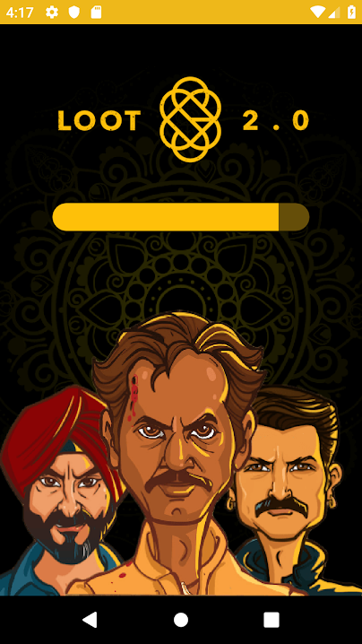
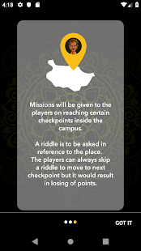
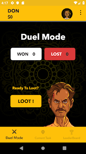

# Loot
An android app, location based game where a user find a mission at a random place in college.Solving the mission player earns coins which he can bet for a duel with other online players on a small game.The api's for the app are written on node.js

Screenshots
-------------------
  
 
 
